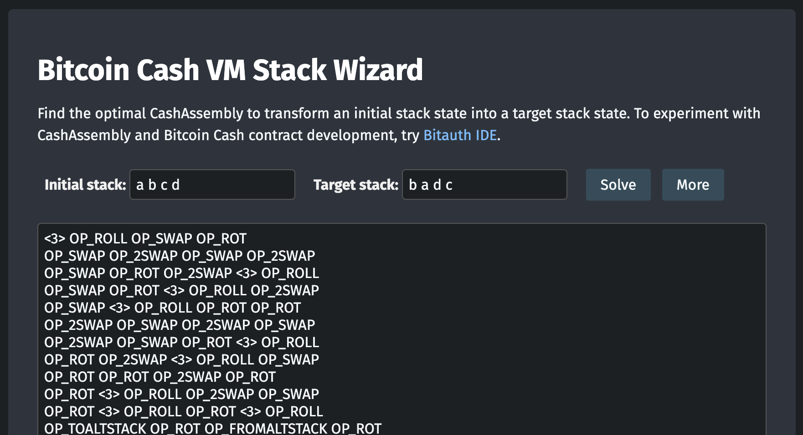

# BCH Wizard

Find the optimal CashAssembly to transform an initial stack state into a target stack state.

BCH Wizard is a stack operation optimizer, based on [Forth Wizard](http://sovietov.com/app/forthwiz.html) by Peter Sovietov.

To experiment with CashAssembly and Bitcoin Cash contract development, try [Bitauth IDE](https://github.com/bitauth/bitauth-ide/).
